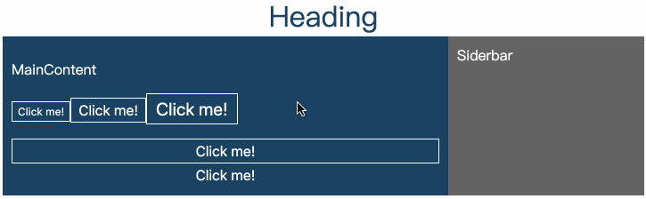

# enhanced-styled-components

## 1-base



```bash
├── components
│   ├── Article
│   │   ├── Article.js
│   │   └── index.js
│   ├── Root
│   │   ├── Root.js
│   │   └── index.js
│   └── shard
│       └── Button
│           └── index.js
├── config
│   └── theme.js
├── index.html
└── index.js

6 directories, 8 files
```

```jsx
const Article = () => {
  return (
    <Wrapper>
      <MainConten>
        <p>MainContent</p>
        <p>
          <Button size="small">Click me!</Button>
          <Button>Click me!</Button>
          <Button size="large">Click me!</Button>
        </p>
        <Button block>Click me!</Button>
        <Button block noBorder>Click me!</Button>
      </MainConten>
      <SideBar>Siderbar</SideBar>
    </Wrapper>
  );
};
```

```jsx
import styled from 'styled-components';

const Button = styled.button`
  appearance: none;
  background-color: ${props => props.theme.regalBlue};
  color: white;
  border: ${props => props.noBorder ? '0' : '1px solid white'};
  padding: 0.25em 0.5em;
  transition: background-color 0.3s, color 0.3s;

  ${props => {
    switch (props.size) {
      case 'small':
        return 'font-size: 12px;';
      case 'large':
        return 'font-size: 20px;';
    }
    return 'font-size: 16px;';
  }}

  ${props => {
    if (props.block) {
      return `
        display: block;
        width: 100%;
      `
    }
  }}

  &:hover {
    background-color: white;
    color: ${props => props.theme.regalBlue};
    cursor: pointer;
  }
`;

export default Button;
```
