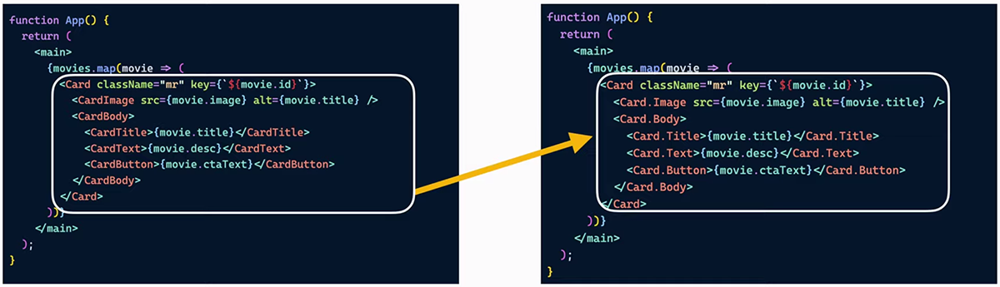
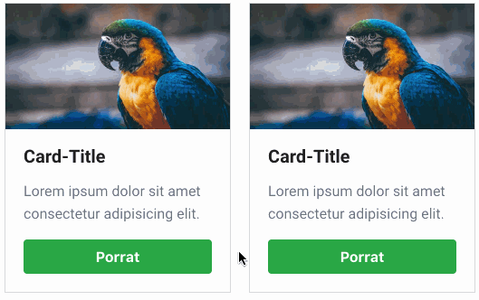

# enhanced-styled-components

## 1-base


```bash
├── components
│   ├── Article
│   │   ├── Article.js
│   │   └── index.js
│   ├── Root
│   │   ├── Root.js
│   │   └── index.js
│   └── shard
│       └── Button
│           └── index.js
├── config
│   └── theme.js
├── index.html
└── index.js

6 directories, 8 files
```

```js
const Article = () => {
  return (
    <Wrapper>
      <MainConten>
        <p>MainContent</p>
        <p>
          <Button size="small">Click me!</Button>
          <Button>Click me!</Button>
          <Button size="large">Click me!</Button>
        </p>
        <Button block>Click me!</Button>
        <Button block noBorder>
          Click me!
        </Button>
      </MainConten>
      <SideBar>Siderbar</SideBar>
    </Wrapper>
  );
};
```

```js
import styled from 'styled-components';

const Button = styled.button`
  appearance: none;
  background-color: ${props => props.theme.regalBlue};
  color: white;
  border: ${props => (props.noBorder ? '0' : '1px solid white')};
  padding: 0.25em 0.5em;
  transition: background-color 0.3s, color 0.3s;

  ${props => {
    switch (props.size) {
      case 'small':
        return 'font-size: 12px;';
      case 'large':
        return 'font-size: 20px;';
    }
    return 'font-size: 16px;';
  }}

  ${props => {
    if (props.block) {
      return `
        display: block;
        width: 100%;
      `;
    }
  }}

  &:hover {
    background-color: white;
    color: ${props => props.theme.regalBlue};
    cursor: pointer;
  }
`;

export default Button;
```

## 2-compound




```js
<Card>
  <Card.Image src={porrot} />
  <Card.Body>
    <Card.Title>Card-Title</Card.Title>
    <Card.Text className="Text">
      Lorem ipsum dolor sit amet consectetur adipisicing elit.
    </Card.Text>
    <Card.Button>Porrat</Card.Button>
  </Card.Body>
</Card>
```

```js
export function Card({ classes, children, ...restProps }) {
  return (
    <Container className={classnames('card', classes)} {...restProps}>
      {children}
    </Container>
  );
}

Card.Body = function CardBody({ classes, children, ...restProps }) {
  return (
    <Body className={classnames('card__body', classes)} {...restProps}>
      {children}
    </Body>
  );
};

Card.Title = function CardTitle({ classes, children, ...restProps }) {
  return (
    <Title className={classnames('card__title', classes)} {...restProps}>
      {children}
    </Title>
  );
};
```

## 3-dribbble-menu

> from html+css to styled-components

### global style

从 style.css 移出全局样式

```js
const GlobalStyle = createGlobalStyle`
html,
body {
  margin: 0;
  padding: 0;
}

body {
  font-family: Roboto, sans-serif;
}
`;

render(
  <>
    <GlobalStyle>
      <h1>hello jerry</h1>
    </GlobalStyle>
  </>,
  document.getElementById('app')
);
```

### create Anchor component

```js
const MainNavigationLogoLink = styled.a.attrs({
  href: '#',
  onClick: evt => {
    evt.preventDefault();
  },
})`
  display: flex;
  height: 100%;
  margin-right: 20px;
  transition: opacity 0.2s ease;

  :hover {
    cursor: pointer;
    opacity: 0.6;
  }

  > img {
    margin: auto;
  }
`;

const Root = () => {
  return (
    <MainNavigation>
      <MainNavigationLogoLink>
        
      </MainNavigationLogoLink>
    </MainNavigation>
  );
};
```

### 关于 hover 的写法

类似这样的 css 在 styled-compoents 里应该如何写呢？

```css
.main-navigation-item:hover .main-navigation-link-dropdown {
  display: block;
}
```

- `MainNavigationItem` 本该写在上方，但因为const的变量，写在上方会拿不到引用
- 不就是 hash 值嘛，怎么就拿不到，奇怪

```js
const MainNavigationLinkDropdown = styled.div`
  background-color: #333333;
  border-bottom-left-radius: 6px;
  border-bottom-right-radius: 6px;
  display: none;
  position: absolute;
  left: 0;
  top: 100%;
`;

const MainNavigationItem = styled.div`
  height: 100%;
  position: relative;

  :hover ${MainNavigationLinkDropdown} {
    display: block;
  }
`;
```

> 23:05
